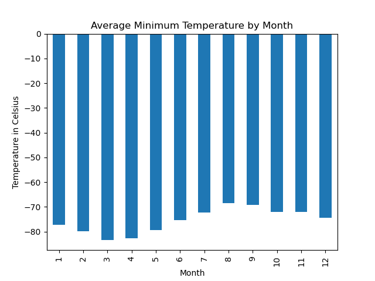
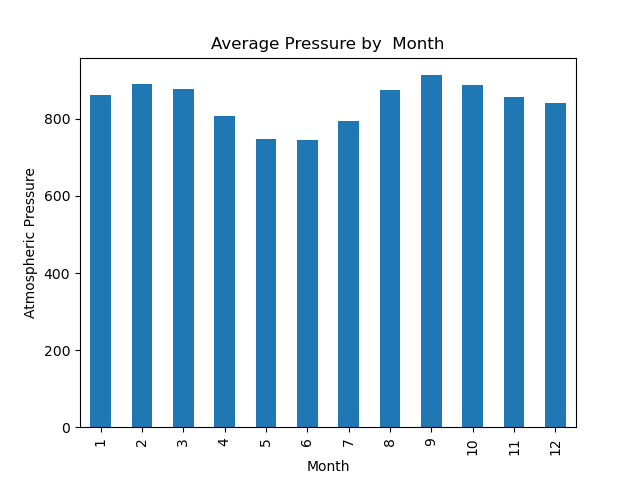

# Mars Web Scraping & Weather Analysis

## Overview

This project demonstrates web scraping and data analysis using Python, BeautifulSoup, Splinter, and Pandas. It is divided into two parts:

1. Scraping recent news titles and preview text from a Mars News website.
2. Scraping and analyzing weather data from Mars based on information collected by NASA’s Curiosity rover.

---

## Deliverables

### Part 1: Mars News Scraping

- Used Splinter and BeautifulSoup to automate browser interaction and scrape titles and preview text of recent Mars news articles.
- Stored each article's title and preview text in a Python dictionary, then added all dictionaries to a list.

---
  
### Part 2: Mars Weather Data Scraping & Analysis

- Scraped a temperature dataset from [Mars Temperature Page](https://static.bc-edx.com/data/web/mars_facts/temperature.html).
- Parsed the HTML table using BeautifulSoup and stored it in a Pandas DataFrame.
- Cleaned and converted columns to appropriate data types (`datetime`, `int`, `float`).

---

## Analysis Summaries

### Minimum Temperature

- **Coldest Month**: Month 3 (`-83.31°C`)
- **Next Coldest**: Month 4 (`-82.75°C`)
- **Warmest Month**: Month 8 (`-68.38°C`)
- **Next Warmest**: Month 9 (`-69.17°C`)
- There’s a steady warming trend from Month 3 to Month 8.
- After Month 8, the temperatures begin to drop again.

#### Bar Chart: Average Minimum Temperature by Month


---

### Atmospheric Pressure

- **Lowest Pressure**: Month 6 (`745.05 Pa`)
- **Highest Pressure**: Month 9 (`913.31 Pa`)
- Pressure steadily drops from Month 2 to Month 6.
- From Month 7 onward, pressure rises, peaks in Month 9, and then gradually declines toward Month 12.

#### Bar Chart: Average Atmospheric Pressure by Month


---

### Temperature Cycle Observation

- The minimum temperature graph shows a repeating pattern of peaks and troughs.
- By estimating the interval between similar points (e.g., peak to peak), the temperature cycle spans about **two Earth years**.
- This aligns with the length of a **Martian year**, which is roughly **687 Earth days (~1.88 Earth years)**.

---

## Technologies Used

- **Python**
- **Jupyter Notebook**
- **BeautifulSoup**
- **Splinter** (with `webdriver-manager`)
- **Pandas**
- **Matplotlib**

---

## Setup Instructions

To run this project in Jupyter Notebook:

1. Ensure Google Chrome and Jupyter Notebook are installed.
2. Install required libraries:
   ```bash
   pip install splinter selenium webdriver-manager beautifulsoup4 pandas matplotlib
